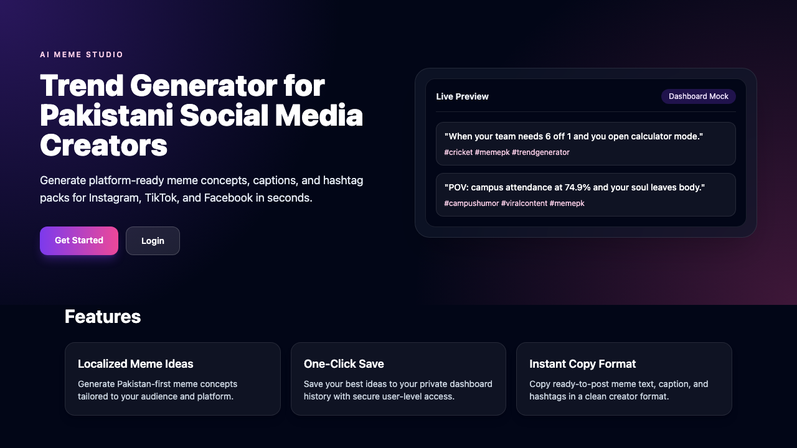

# Trend Generator (meme-generator-pk)

Generate and save Pakistan-focused social media meme ideas with Next.js, Supabase Auth/DB, and Anthropic Claude.

## Preview



## 1. Setup Instructions

1. Clone the repository:
   ```bash
   git clone <your-repo-url>
   cd meme-generator-pk
   ```
2. Install dependencies:
   ```bash
   npm install
   ```
3. Copy environment template:
   ```bash
   cp .env.example .env.local
   ```
4. Add your Supabase credentials to `.env.local`.
5. Add your Anthropic Claude API key to `.env.local`.
6. Start the dev server:
   ```bash
   npm run dev
   ```
7. Open [http://localhost:3000](http://localhost:3000).

## Environment Variables

Set these in `.env.local`:

```env
NEXT_PUBLIC_SUPABASE_URL=
NEXT_PUBLIC_SUPABASE_ANON_KEY=
ANTHROPIC_API_KEY=
```

- `NEXT_PUBLIC_SUPABASE_URL`: Supabase project URL
- `NEXT_PUBLIC_SUPABASE_ANON_KEY`: Supabase anon/public key
- `ANTHROPIC_API_KEY`: Anthropic API key used by `/api/generate-ideas`

## 2. Supabase Setup Steps

1. Create a new project in the [Supabase Dashboard](https://supabase.com/dashboard).
2. Open **SQL Editor** and run the schema from:
   - `supabase-schema.sql`
3. Enable Email Auth:
   - Go to **Authentication** -> **Providers**
   - Ensure **Email** provider is enabled
4. Copy credentials:
   - Go to **Project Settings** -> **API**
   - Copy:
     - `Project URL` -> `NEXT_PUBLIC_SUPABASE_URL`
     - `anon public` key -> `NEXT_PUBLIC_SUPABASE_ANON_KEY`

## 3. Get API Key From Anthropic

1. Sign in at [Anthropic Console](https://console.anthropic.com/).
2. Go to **API Keys**.
3. Create a new key.
4. Add it to `.env.local` as:
   - `ANTHROPIC_API_KEY=...`

## Notes

- The app uses Supabase Auth for user accounts and row-level security for per-user idea access.
- AI generation route is `POST /api/generate-ideas` and requires authenticated users.
